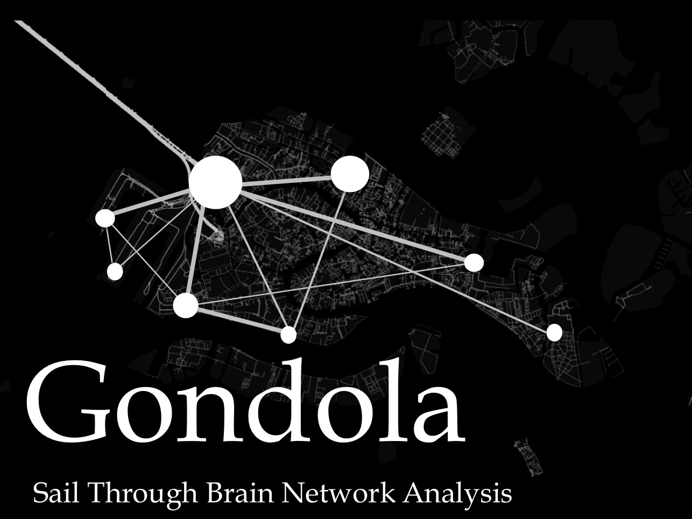

<!-- START POST CODE: copy paste the code till the next comment to create a new entry. If you want to add an image, it should be placed in files/images/GondolaLogo.png -->

## Gondola

::: {.grid}

::: {.g-col-12 .g-col-md-2}

:::

::: {.g-col-12 .g-col-md-10}
**Maintainer(s)** [Alessandro Tonin](https://github.com/Lychfindel), &nbsp; [Ettore Napoli](https://github.com/anemos96)

[Gondola](https://github.com/giorgioarcara/Gondola) is a Matlab Toolbox to facilitate brain network analysis.

_Development stage:_ final stages

:::

:::

<!-- END POST CODE: copy above the code chunck above till the next comment to create a new post) -->

## Herbert

::: {.grid}

::: {.g-col-12 .g-col-md-2}

:::

::: {.g-col-12 .g-col-md-10}
**Maintainer(s)** [Alessandro Tonin](https://github.com/Lychfindel), &nbsp; [Ettore Napoli](https://github.com/anemos96)

[Herbert](https://github.com/SanCamilloIRCCS-OndaLab/Herbert) is a Matlab Toolbox for Multiverse analysis.

_Development stage:_ unit testing

:::

:::

<!--
## Class 2

::: {.grid}

::: {.g-col-12 .g-col-md-2}

:::

::: {.g-col-12 .g-col-md-10}

[Spring 2025](https://www.google.com), &nbsp; [Fall 2023](https://www.google.com)

Class 2 introduction.

:::

:::

## Class 3

::: {.grid}

::: {.g-col-12 .g-col-md-2}

:::

::: {.g-col-12 .g-col-md-10}

[Spring 2025](https://www.google.com), &nbsp; [Spring 2024](https://www.google.com)

Class 3 introduction. 

:::

:::
-->

